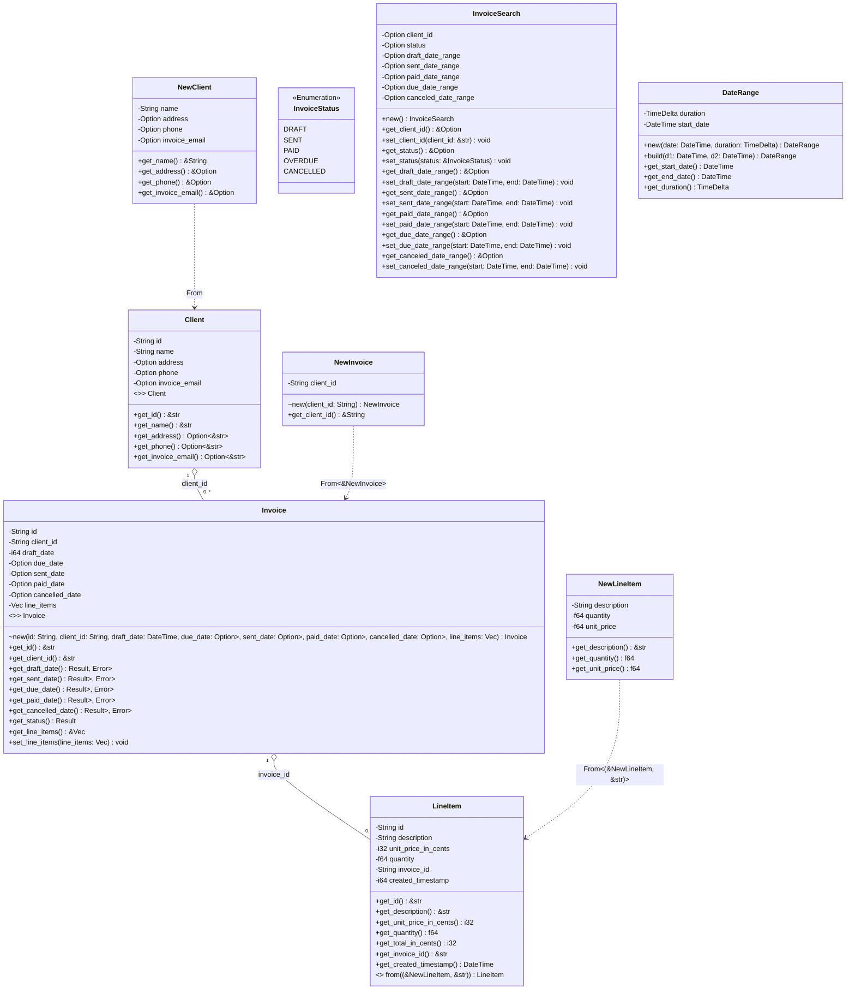

# Models

```mermaid
classDiagram

    class NewLineItem {
        -String description
        -f64 quantity
        -f64 unit_price

        +get_description() &str
        +get_quantity() f64
        +get_unit_price() f64
    }

    class NewClient {
        -String name
        -Option<String> address
        -Option<String> phone
        -Option<String> invoice_email

        +get_name() &String
        +get_address() &Option<String>
        +get_phone() &Option<String>
        +get_invoice_email() &Option<String>
    }

    class NewInvoice {
        -String client_id

        ~new(client_id: String) NewInvoice
        +get_client_id() &String
    }

    class LineItem {
        -String id
        -String description
        -i32 unit_price_in_cents
        -f64 quantity
        -String invoice_id
        -i64 created_timestamp

        +get_id() &str
        +get_description() &str
        +get_unit_price_in_cents() i32
        +get_quantity() f64
        +get_total_in_cents() i32
        +get_invoice_id() &str
        +get_created_timestamp() DateTime<Utc>

        <<Create>> from((&NewLineItem, &str)) LineItem
    }

    class InvoiceStatus {
    }
    <<Enumeration>> InvoiceStatus
    InvoiceStatus : DRAFT
    InvoiceStatus : SENT
    InvoiceStatus : PAID
    InvoiceStatus : OVERDUE
    InvoiceStatus : CANCELLED

    class Invoice {
-String id
-String client_id
-i64 draft_date
-Option<i64> due_date
-Option<i64> sent_date
-Option<i64> paid_date
-Option<i64> cancelled_date
-Vec<LineItem> line_items

~new(id: String, client_id: String, draft_date: DateTime<Utc>, due_date: Option<DateTime<Utc>>, sent_date: Option<DateTime<Utc>>, paid_date: Option<DateTime<Utc>>, cancelled_date: Option<DateTime<Utc>>, line_items: Vec<LineItem>) Invoice
+get_id() &str
+get_client_id() &str
+get_draft_date() Result<DateTime<Utc>, Error>
+get_sent_date() Result<Option<DateTime<Utc>>, Error>
+get_due_date() Result<Option<DateTime<Utc>>, Error>
+get_paid_date() Result<Option<DateTime<Utc>>, Error>
+get_cancelled_date() Result<Option<DateTime<Utc>>, Error>
+get_status() Result<InvoiceStatus, Error>
+get_line_items() &Vec<LineItem>
+set_line_items(line_items: Vec<LineItem>) void

<<From<&NewInvoice>>> Invoice
}

class Client {
-String id
-String name
-Option<String> address
-Option<String> phone
-Option<String> invoice_email

<<From<NewClient>>> Client
+get_id() &str
+get_name() &str
+get_address() Option<&str>
+get_phone() Option<&str>
+get_invoice_email() Option<&str>
}

class InvoiceSearch {
-Option<String> client_id
-Option<InvoiceStatus> status
-Option<DateRange> draft_date_range
-Option<DateRange> sent_date_range
-Option<DateRange> paid_date_range
-Option<DateRange> due_date_range
-Option<DateRange> canceled_date_range

+new() InvoiceSearch
+get_client_id() &Option<String>
+set_client_id(client_id: &str) void
+get_status() &Option<InvoiceStatus>
+set_status(status: &InvoiceStatus) void
+get_draft_date_range() &Option<DateRange>
+set_draft_date_range(start: DateTime<Utc>, end: DateTime<Utc>) void
+get_sent_date_range() &Option<DateRange>
+set_sent_date_range(start: DateTime<Utc>, end: DateTime<Utc>) void
+get_paid_date_range() &Option<DateRange>
+set_paid_date_range(start: DateTime<Utc>, end: DateTime<Utc>) void
+get_due_date_range() &Option<DateRange>
+set_due_date_range(start: DateTime<Utc>, end: DateTime<Utc>) void
+get_canceled_date_range() &Option<DateRange>
+set_canceled_date_range(start: DateTime<Utc>, end: DateTime<Utc>) void
}

class DateRange {
-TimeDelta duration
-DateTime<Utc> start_date

+new(date: DateTime<Utc>, duration: TimeDelta) DateRange
+build(d1: DateTime<Utc>, d2: DateTime<Utc>) DateRange
+get_start_date() DateTime<Utc>
+get_end_date() DateTime<Utc>
+get_duration() TimeDelta
}

%% Relationships
Client "1" o-- "0..*" Invoice : client_id
Invoice "1" o-- "0..*" LineItem : invoice_id

%% Builder/Conversion relationships (dashed to indicate construction)
NewClient ..> Client : From<NewClient>
NewLineItem ..> LineItem : From<(&NewLineItem, &str)>
NewInvoice ..> Invoice : From<&NewInvoice>
```

