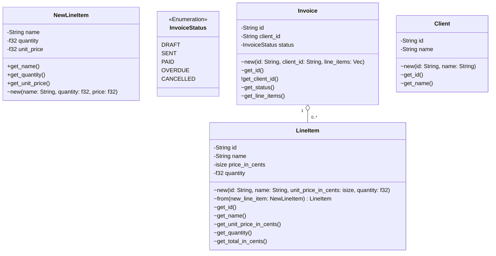

# Models

```mermaid
classDiagram
    
    class NewLineItem{
        -String name
        -f32 quantity
        -f32 unit_price
        
        +get_name()
        +get_quantity()
        +get_unit_price()

        ~new(name: String, quantity: f32, price: f32)
    }
    
    class LineItem{
        -String id
        -String name
        -isize price_in_cents
        -f32 quantity
        
        ~new(id: String, name: String, unit_price_in_cents: isize, quantity: f32)
        ~from(new_line_item: NewLineItem) LineItem
        ~get_id()
        ~get_name()
        ~get_unit_price_in_cents()
        ~get_quantity()

        ~get_total_in_cents()
    }

    
    class InvoiceStatus
    <<Enumeration>> InvoiceStatus
    InvoiceStatus : DRAFT
    InvoiceStatus : SENT
    InvoiceStatus : PAID
    InvoiceStatus : OVERDUE
    InvoiceStatus : CANCELLED
    
    class Invoice {
        -String id
        -String client_id
        -InvoiceStatus status
        
        ~new(id: String, client_id: String, line_items: Vec<LineItem>)
        ~get_id()
        !get_client_id()
        ~get_status()
        ~get_line_items()
    }
    
    class Client {
        -String id
        -String name
        
        ~new(id: String, name: String)
        ~get_id()
        ~get_name()
    }
    
    Invoice "1" o-- "0..*" LineItem
```

